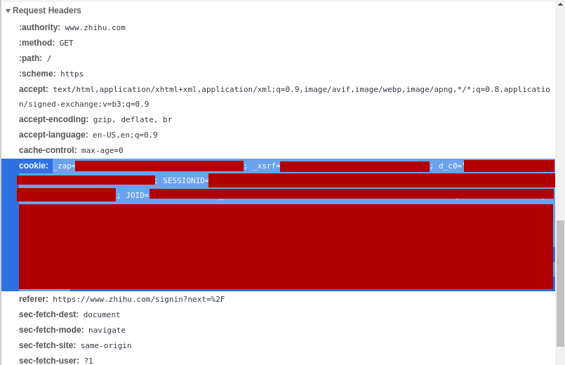

# WbbuBot

中文互联网转载/存档 Bot

## 基本功能

WbbuBot 是个 [Inline Bot](https://core.telegram.org/bots/inline)，可以直接通过下列方式使用：

Inline 模式：
```
@wbbubot url
```

或群聊模式：

```
/backup@wbbubot url
```

将中文社交平台上的文章备份并转载到 [Telegram](https://telegram.org/) 平台上。

给 WbbuBot 一个内容的链接 `url`，可以选择发出在 [Telegra.ph](https://telegra.ph) 上的存档链接或者直接发出内容。（注意：Inline 模式限制每条消息里最多只能有一个图片或视频）

也可以直接把 `url` 直接私信发给本 Bot。

目前支持的平台和内容见下表：

| 平台 | 免登录 | 可存档内容类型 | 暂不支持的内容 |
|:---:|:---:|:---:|:---:|
| [微博](#weibo) | ⍻ | 文字、图片、视频 | 头条文章 |
| [知乎](#zhihu) | ⍻ | 回答、问题、专栏文章、想法 | 视频 |
| [微信](#wechat) | ✓ | 公众号文章 | |
| [豆瓣](#douban) | ✓ | 书评/影评、日记、广播、小组话题 | 短评 |
| [任意链接](#other) | ⍻ | 网页（文字、图片、视频、文件） | |

注意：

文字、图片和视频会被上传在 [Telegra.ph](https://telegra.ph) 上，但有大小限制（大约 50 MB），超过限制的内容会被自动存在一个 AWS S3 bucket 上。

用户也可以设置一个 AWS S3 bucket 来提供存放超过大小限制的文件。（参见 [AWS S3 设置](#S3-setting)）

### 已知问题

暂不支持过长的内容备份，暂时无法备份评论区

将来会考虑加入豆瓣小组帖子和微博文章等内容。

### <a name="weibo"></a> 微博

[微博](https://weibo.com)。

支持网页版、手机版或是手机国际版的分享链接例如：

```
@wbbubot https://weibo.com/2803301701/JummswXqm
@wbbubot https://m.weibo.cn/detail/4572358007854926
@wbbubot http://weibointl.api.weibo.com/share/184529863.html?weibo_id=4572358007854926
```

部分内容需要登录才能获取，暂不支持微博文章。

Cookie 设置地址：https://m.weibo.cn

### <a name="zhihu"></a> 知乎

[知乎](https://www.zhihu.com)回答和专栏文章，链接格式：

```
@wbbubot https://www.zhihu.com/question/395525046/
@wbbubot https://www.zhihu.com/answer/1284606651
@wbbubot https://zhuanlan.zhihu.com/p/89274560
```

部分内容需要登录才能获取，暂不支持知乎视频。

Cookie 设置地址：https://zhihu.com

### <a name="wechat"></a> 微信

[微信](https://mp.weixin.qq.com)公众号的文章，链接格式：

```
@wbbubot https://mp.weixin.qq.com/s/NnmgcJRAurTsCxTbCo7Mmw
```

无需登录。


### <a name="douban"></a> 豆瓣

[豆瓣](https://www.douban.com)上各种内容，链接格式：

```
@wbbubot https://book.douban.com/review/3000000/
@wbbubot https://www.douban.com/note/300000000/
@wbbubot https://www.douban.com/people/1000000/status/1234567890/
@wbbubot https://www.douban.com/group/topic/200000000
```

无需登录。

Cookie 设置地址：https://douban.com

### <a name="media"></a> 任意媒体链接

任何无需登录即可访问的图片/视频的外网链接，例如

```
@wbbubot https://wx3.sinaimg.cn/images/default_d_h_mw690.gif
@wbbubot https://www.apple.com/105/media/us/iphone-12-pro/2020/e70ffbd8-50f1-40f3-ac36-0f03a15ac314/anim/hero/large.mp4
```

媒体文件也都有 50MB 的大小限制。

## <a name="setup"></a>设置

所有设置用命令均需要私信直接发送给本 Bot。

### 启用或禁用 WbbuBot

可以直接在聊天框中使用，无需设置。

### 获取 Telegra.ph 帐号

本 Bot 会为每个用户自动建立一个 Telegra.ph 帐号，用来发表转发的文章。如果你需要获取这个帐号的信息，使用这个命令：

```
/telegraph-account
```

如果需要重新建立帐号请使用这个命令：

```
/new-telegraph-account
```

### 设置登录状态

使用以下命令设置登录状态：

```
/cookie url [cookie_string]
```

`url` 为指定网站的地址，`cookie_string` 为 Cookie 的内容。

如果不提供 `cookie_string`，则表示显示在该网站的当前登录状态。

#### 取得 Cookie 的办法

首先在浏览器中登录目标网站。建议使用隐私模式开一个新的窗口，这可以保证登录状态不会与在浏览器中已经登录的帐号冲突。

- 微博请在手机版网站登录：[https://m.weibo.cn](https://m.weibo.cn)
- 知乎在主页登录即可：[https://www.zhihu.com](https://www.zhihu.com)

以 Chrome 为例，获取 Cookie 的步骤：

- 在登录后再次访问上述链接。
- 使用 `Ctrl+Shift+I` 打开开发者工具窗口，切换到 Network 选项卡。
- 刷新页面，在开发者工具中找到 Name 为当前网址的那一行（通常为第一项），单击选中。
- 在详细信息中找到 `Request Headers`，复制 `cookie: ` 之后的全部内容（如下图），即为上述的 `cookie_values`。

> 注意：把 Cookie 发送给第三方程序有一定的风险，本 Bot 承诺不会将 Cookie 用于指定用户或群使用以外的任何目的。



登录状态在一定时间之后可能会失效，需要重新设置否则会无法正常使用本 Bot。

### <a name="s3-setting"></a>AWS S3 设置

有时候过大的图片和视频无法上传至 Telegra.ph 和 Telegram 的服务器，此时可以选用 AWS S3 作为备用存储平台，需要设置一个 S3 Bucket：

```
/config-s3 {"accessPoint":"ACCESS_POINT_NAME","accountID":"ACCOUNT_ID","bucket":"BUCKET_NAME","region":"REGION"}
```

必须提供如上的 JSON，四个属性缺一不可。Bucket 需要开启 Public Access 以允许外网访问。

### 共享登录状态与 AWS S3 设置

如果想与朋友共享登录状态和 AWS S3 设置，可以使用以下命令创建或加入一个共享组：

```
/create-share group_name password
/share [group_name password]
/stop-share group_name [password]
```

**（此功能之后可能会有更改）**

`group_name` 为一个只由字母、数字和 `_` 符号组成的任意名字，`password` 为一个由字母、数字和空白符号以外的符号。

加入同一个共享组的人会共享使用登录状态和 AWS S3 的设置。如果同一个共享组中有多人设置了登录状态，则每次使用时会随机使用其中的一个或多个登录状态。S3 设置也会被随机使用。

每个用户只能创建/加入一个共享组，需要停止（退出）当前的共享状态才可以创建/加入新的组。

第一个命令也可以用来更改密码（只有创建者有权限）。

如果使用第二个命令时的参数为空，显示已经加入的共享组信息。

创建者需要输入密码才能解散共享组。

## 问题反馈

请在 GitHub 的 Issues 区留言：[https://github.com/Zedekul/wbbubot/issues](https://github.com/Zedekul/wbbubot/issues)

## 声明

WbbuBot 不会保存任何必要信息以外的数据，参见：[隐私模式](https://core.telegram.org/bots#privacy-mode)

本 Bot 免费使用，但使用的一切后果由用户自行承担。
